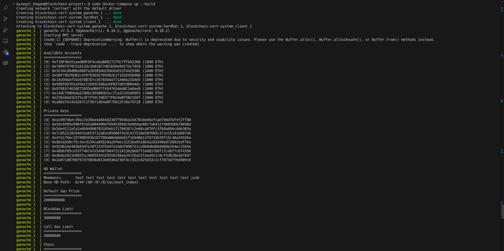
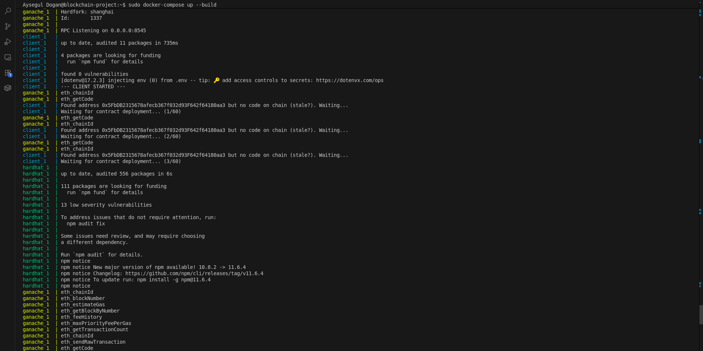
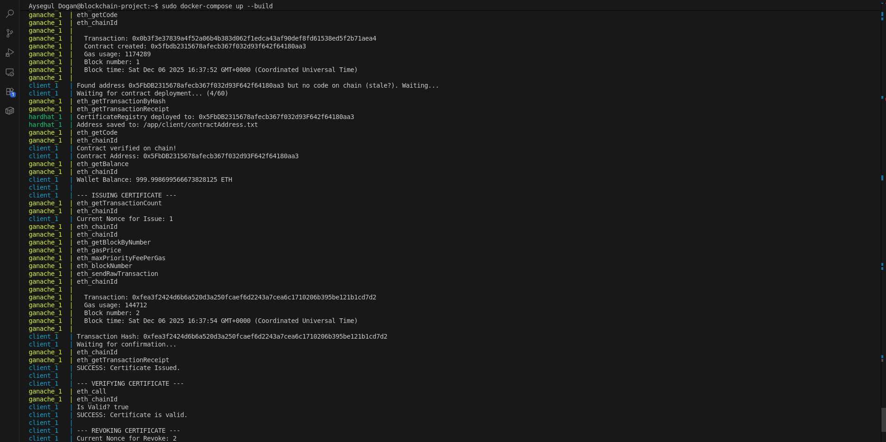
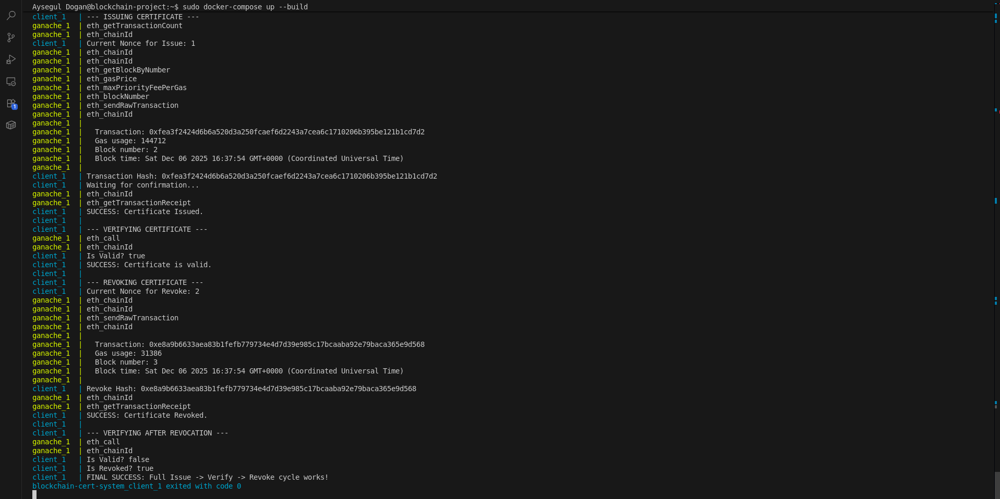

# Blockchain Tabanlı Sertifika Doğrulama Sistemi

Bu proje, Docker üzerinde çalışan yerel bir Ethereum (EVM) uyumlu blokzincir altyapısı kullanarak, güvenli ve KVKK uyumlu sertifika oluşturma, doğrulama ve iptal etme süreçlerini simüle eder.

## 📂 Proje Yapısı

  * `contracts/`: Solidity tabanlı Akıllı Kontrat (*CertificateRegistry.sol*).
  * `client/`: Node.js istemci uygulaması (Sertifika hashleme, imzalama ve doğrulama).
  * `scripts/`: Hardhat dağıtım senaryoları.
  * `docker-compose.yml`: Tüm sistemi (Ganache, Hardhat, Client) ayağa kaldıran konfigürasyon.

## 🚀 Kurulum ve Çalıştırma

Proje Docker ve Docker Compose kullanılarak tek komutla çalıştırılabilir.

1.  **Hazırlık:** Terminali açın ve proje klasörüne gidin.
2.  **Sistemi Başlatın:** Aşağıdaki komutu çalıştırın:

<!-- end list -->

```bash
sudo docker-compose up --build
```

### 3. Beklenen Sonuç (Senaryo)

Komut çalıştırıldığında sistem otomatik olarak sırasıyla şunları yapar:

  * **Ganache Başlatılır:** Yerel blokzincir ayağa kalkar (Port 8545).
  * **Kontrat Dağıtılır:** Hardhat, `CertificateRegistry` kontratını derler ve ağa yükler.
  * **İstemci (Client) Çalışır:**
      * `Issue`: Yeni bir sertifika oluşturur ve blokzincire yazar.
      * `Verify`: Sertifikanın geçerli olduğunu doğrular.
      * `Revoke`: Sertifikayı iptal eder (Revocation).
      * `Verify` (Tekrar): Sertifikanın artık geçersiz olduğunu doğrular.

Terminal çıktısının en sonunda şu başarı mesajını görmelisiniz:

```text
FINAL SUCCESS: Full Issue -> Verify -> Revoke cycle works!
```

### 📸 Ekran Görüntüleri
Aşağıdaki ekran görüntüleri sistemin uçtan uca çalışmasını göstermektedir:






## 🎥 Demo Videosu

Projenin çalışır halini gösteren demo videosuna aşağıdaki bağlantıdan ulaşabilirsiniz:
*   [Demo Video Linki](https://youtube.com/...)

## 📄 Teknik Rapor

Projenin mimarisi, güvenlik önlemleri ve KVKK uyumluluğu hakkında detaylı bilgi için [REPORT.md](REPORT.md) dosyasına bakınız.

## ⚙️ Teknik Detaylar

  * **Ağ:** `certnet` isimli Docker ağı üzerinde ganache, hardhat ve client servisleri izole haberleşir.
  * **Gizlilik (KVKK):** Kişisel veriler (Ad, Öğrenci No) asla zincire yazılmaz. Bunun yerine `keccak256(ogrNo|ADSOYAD|salt)` formülü ile üretilen hash değeri saklanır.
  * **Gas Yönetimi:** Docker ortamındaki tahmin hatalarını önlemek için işlemler *Legacy (Type 0)* formatında ve manuel gas limiti ile gönderilir.

## 🧪 Birim Testleri

Proje altyapısı Docker dışında test edilmek istenirse, yerel Hardhat ortamı kullanılabilir:

```bash
npm install
npx hardhat test
```